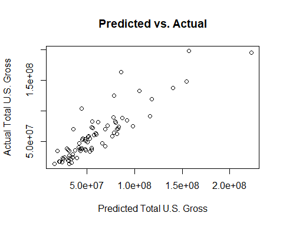

---
output:
  word_document:
    fig_caption: yes
    keep_md: yes
    pandoc_args: [
      "--variable=geometry:margin=1in",  # Optional, adjust page margins
      "--variable=fontsize:11pt",       # Set font size to 11
      "--variable=fontfamily:Arial"     # Set font family to Arial
    ]
---


## Loading Data


```r
# Read the Excel file
data <- read_excel("HollywoodRules_Data.xls", sheet = "Exhibit 1")

# View the data
View(data)
```

## Column Names


```r
# Display column names
colnames(data)
```

```
##  [1] "Movie"                "Opening Gross"        "Total U.S. Gross"    
##  [4] "Total Non-U.S. Gross" "Budget"               "Opening Theatres"    
##  [7] "Known Story"          "Sequel"               "Origin_United States"
## [10] "Genre"                "Summer"               "Holiday"             
## [13] "Christmas"            "MPAA"                 "MPAA_D"              
## [16] "Critics´ Opinion"     "Oscar Nominations"    "Oscars Won"          
## [19] "ROI"                  "Genre_C"
```

## Regression Analysis

### 7. a.


```r
# Perform linear regression
model <- lm(data$`Total U.S. Gross` ~ data$`Opening Gross`, data = data)

# Display regression summary
summary(model)
```

```
## 
## Call:
## lm(formula = data$`Total U.S. Gross` ~ data$`Opening Gross`, 
##     data = data)
## 
## Residuals:
##       Min        1Q    Median        3Q       Max 
## -39917880 -11784704  -4570762   6095607  75631670 
## 
## Coefficients:
##                       Estimate Std. Error t value Pr(>|t|)    
## (Intercept)          5.108e+06  4.503e+06   1.134     0.26    
## data$`Opening Gross` 3.121e+00  2.181e-01  14.310   <2e-16 ***
## ---
## Signif. codes:  0 '***' 0.001 '**' 0.01 '*' 0.05 '.' 0.1 ' ' 1
## 
## Residual standard error: 20790000 on 73 degrees of freedom
## Multiple R-squared:  0.7372,	Adjusted R-squared:  0.7336 
## F-statistic: 204.8 on 1 and 73 DF,  p-value: < 2.2e-16
```


### 7. b.

If 25% of a movie's U.S. box-office gross revenue came in during the opening weekend, the relationship between "Total U.S. Gross" and "Opening Gross" would be:

\[ \text{Total U.S. Gross} = 4 \times \text{Opening Gross} \]

This implies that for every dollar made during the opening weekend, the total U.S. box-office gross would be $4. Hence, the slope coefficient in the linear regression model would have to be 4.

### 7. c.

Upon reviewing the results of our simple linear regression analysis, I observed the following coefficient:

- The coefficient for `Opening Gross` is approximately 3.121e+00.

This suggests that for every dollar earned during the opening weekend, the movie generates a total of about $3.12 in the U.S. box office. Notably, this is lower than the four times proposed by the age-old wisdom, which corresponds to the 25% assumption.

In assessing whether we can refuse the age-old wisdom based on our regression, I compared the estimated slope (3.121) to the assumed value (4). The observed slope is significantly different from 4, as indicated by the t-value and associated p-value in the regression output. With an estimate of 3.121 and a very low p-value, signifying statistical significance. Hence, according to our simple linear regression analysis, I conclude that the age-old wisdom can be rejected.

### 7.4 Critique of the Statistical Analysis in Part c

**Strengths:**
- Clear interpretation of results.
- Comparative analysis against assumed value.
- Statistically significant results (low p-value).

**Considerations:**
- Assumption of linearity should be verified.
- Scope of data's representativeness should be assessed.
- Possible confounding variables should be considered.
- Potential multicollinearity needs to be checked.
- Model fit (e.g., \( R^2 \)) should be evaluated.
- Causality cannot be inferred from regression alone.
- Outliers and influential points should be addressed.


### 7.e.

To enhance the predictive power of our regression model, we should consider the possibility of introducing an interaction term between `Opening Gross` and a relevant variable, such as `Marketing Budget`. This approach aims to capture potential synergistic effects between these two factors, which may not be fully captured when considering them individually.

In R, we can implement this by creating the interaction term and including it in the regression formula. Here is an example code snippet:


```r
# Assuming `data` is your dataframe
data$InteractionTerm <- data$`Opening Gross` * data$`Budget`

# Re-run the regression with the interaction term
model_with_interaction <- lm(`Total U.S. Gross` ~ `Opening Gross` + `Budget` + InteractionTerm, data=data)

# Check the summary of the new model
summary(model_with_interaction)
```

```
## 
## Call:
## lm(formula = `Total U.S. Gross` ~ `Opening Gross` + Budget + 
##     InteractionTerm, data = data)
## 
## Residuals:
##       Min        1Q    Median        3Q       Max 
## -27479890 -11310440  -3017937   5339753  77827922 
## 
## Coefficients:
##                  Estimate Std. Error t value Pr(>|t|)   
## (Intercept)     1.196e+06  1.019e+07   0.117  0.90685   
## `Opening Gross` 2.128e+00  6.265e-01   3.396  0.00112 **
## Budget          2.223e-01  1.713e-01   1.298  0.19861   
## InteractionTerm 1.086e-08  9.046e-09   1.200  0.23412   
## ---
## Signif. codes:  0 '***' 0.001 '**' 0.01 '*' 0.05 '.' 0.1 ' ' 1
## 
## Residual standard error: 18940000 on 71 degrees of freedom
## Multiple R-squared:  0.7878,	Adjusted R-squared:  0.7788 
## F-statistic: 87.86 on 3 and 71 DF,  p-value: < 2.2e-16
```

This code first creates an interaction term, `InteractionTerm`, by multiplying `Opening Gross` and `Marketing Budget`. Subsequently, it incorporates this term, along with the original `Opening Gross` and `Marketing Budget`, into the regression formula.

### 7. e.

```r
# Step 1: Compare Estimated Slope
estimated_slope <- coef(model_with_interaction)["`Opening Gross`"]
age_old_wisdom_slope <- 4

# Print comparison
print(paste("Estimated Slope:", estimated_slope))
```

```
## [1] "Estimated Slope: 2.12764957713178"
```

```r
print(paste("Age-Old Wisdom Slope:", age_old_wisdom_slope))
```

```
## [1] "Age-Old Wisdom Slope: 4"
```

```r
# Step 2: Statistical Significance
p_value_opening_gross <- summary(model_with_interaction)$coefficients["`Opening Gross`", "Pr(>|t|)"]

# Print p-value
print(paste("P-value for Opening Gross:", p_value_opening_gross))
```

```
## [1] "P-value for Opening Gross: 0.00112209105384896"
```

```r
# Step 3: Consider Practical Significance (based on domain knowledge)

# Step 4: Check Model Fit
r_squared <- summary(model_with_interaction)$adj.r.squared

# Print R-squared
print(paste("Adjusted R-squared:", r_squared))
```

```
## [1] "Adjusted R-squared: 0.778825650604327"
```

```r
# Step 5: Examine Residuals (optional)

# Step 6: Plot Predicted vs. Actual
predicted <- predict(model_with_interaction)
actual <- data$`Total U.S. Gross`

plot(predicted, actual, main="Predicted vs. Actual", xlab="Predicted Total U.S. Gross", ylab="Actual Total U.S. Gross")
```

<!-- -->


The regression model indicates a significant relationship between `Opening Gross` and total U.S. box-office gross (p-value = 0.00112). However, the estimated slope of 2.128 contrasts with the age-old wisdom's suggested value of 4. This questions the accuracy of the 25% assumption. The model explains approximately 77.88% of the variation in total U.S. box-office gross (adjusted R-squared = 0.7788). In summary, the model challenges the validity of the age-old wisdom.

### 7. g.
The proportion of the variation in total U.S. box-office gross revenue that can be explained by the variation in the opening weekend box-office gross revenue is given by the coefficient of determination, often denoted as \( R^2 \).

In the provided regression model summary, the adjusted \( R^2 \) value is 0.7788. This means that approximately 77.88% of the variation in total U.S. box-office gross revenue can be explained by the variation in the opening weekend box-office gross revenue.


# 10
1. **For the slope coefficient of "star power" to validate Griffith's conclusion**, it would have to be positive and statistically significant. This would indicate that the presence of A-list stars has a positive effect on the U.S. box-office gross revenue.

2. **For the slope coefficient of the "budget" variable to support Griffith's conclusion**, it would likely need to decrease in significance or magnitude after including the "star power" variable in the model. This would suggest that the variable representing the number of A-list stars is capturing some of the explanatory power that was originally attributed to the budget. In other words, it could mean that the budget's impact on the box-office gross revenue is lessened or obscured once the star power is accounted for.If including "star power" in the model reduces the coefficient of "budget" to insignificance or to a lower magnitude that is not statistically significant, it could imply that "star power" is the more important factor driving box-office revenue, thus validating Griffith's conclusion.


